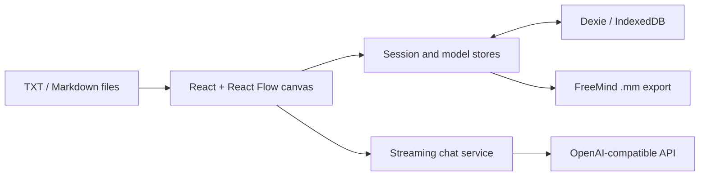

<p align="center">
  
</p>

<div align="center">

# TreeAI

[](https://github.com/Anionex/treeAI/stargazers)
[](https://github.com/Anionex/treeAI/forks)
[](https://github.com/Anionex/treeAI/actions/workflows/ci.yml)
[](LICENSE)

[](package.json)
[](src/)

**Branch the conversation. Keep every line of thought.**

A local-first visual workspace for exploring, comparing, and exporting LLM conversation trees across OpenAI-compatible models.

🌐 [**中文**](README_CN.md) | **English**

</div>

Linear chat forces every follow-up into one timeline: explore a different assumption and the original path is pushed out of view. TreeAI turns the conversation into a canvas. Continue from any node, create parallel branches, switch model settings per branch, and preserve every route for later comparison.

All sessions and model configurations stay in the browser's IndexedDB. Requests go directly from the browser to the API endpoint you configure; TreeAI has no application backend.

<p align="center">
  
</p>

<p align="center"><sub>One prompt, multiple independent paths. Continue any branch without overwriting the others.</sub></p>

## Why TreeAI

| Capability | What it gives you |
|---|---|
| **Branch from any node** | Explore an alternative question, assumption, or answer while preserving the original conversation path. |
| **Tune each branch independently** | Select the model, temperature, and token budget at the node level instead of locking one configuration to the whole session. |
| **Keep the workspace local** | Store sessions and model profiles in browser IndexedDB with no TreeAI server in the middle. |
| **Bring in text context** | Add `.txt` and `.md` files as a new conversation node. |
| **Export the tree** | Download a FreeMind-compatible `.mm` file for archiving or further mind-map work. |

## Quick Start

### Prerequisites

- Node.js 18 or newer
- npm
- An OpenAI-compatible API that supports streaming `POST /chat/completions`
- A provider that allows browser CORS requests from your TreeAI origin

### Run locally

```bash
git clone https://github.com/Anionex/treeAI.git
cd treeAI
npm ci
npm run dev
```

Open the local URL printed by Vite, usually `http://localhost:5173`.

### First conversation

1. Open **Model settings** from the gear button in the lower-left corner.
2. Add a model name, an API base URL such as `https://api.openai.com/v1`, an API key, and the provider's model identifier.
3. Create a conversation and edit the system-prompt node.
4. Add a child node, enter a message, and send it.
5. Use the **+** button on any node to continue that branch or start a parallel one.

> [!IMPORTANT]
> API keys are stored unencrypted in this browser's IndexedDB because TreeAI is a client-only application. Use restricted keys or a trusted local proxy, and do not configure secrets on a shared or untrusted device.

## How It Works



- **Conversation graph:** each chat node stores a `parentId`, allowing the UI to reconstruct and render independent branches.
- **Context assembly:** when a node is sent, TreeAI walks its ancestors and sends only that branch's message chain.
- **Streaming:** responses are consumed from Server-Sent Events and rendered incrementally in the active node.
- **Persistence:** sessions, node positions, and model profiles are stored locally through Dexie.

## Compatibility and Data Boundaries

TreeAI currently targets OpenAI-style streaming Chat Completions APIs. A compatible provider must:

- expose `POST {baseUrl}/chat/completions`;
- accept `Authorization: Bearer ...`;
- return `data:` Server-Sent Events with OpenAI-like `choices[0].delta.content`, or one of the small fallback text shapes handled in `apiService.ts`;
- allow direct browser requests through CORS.

TreeAI sends the configured API key directly to that provider. The repository does not include a relay server, analytics service, or cloud account system.

## Project Status and Limitations

TreeAI is an early-stage project (`0.1.0`). The core branching workflow builds and runs, but the following constraints are intentional and user-visible:

- reasoning-model or provider-specific thinking streams are not supported;
- only `.txt` and `.md` file text extraction is enabled;
- model credentials are stored locally without encryption;
- there is no account sync, collaboration, or cross-device backup;
- automated application tests have not been added yet; CI currently verifies lint and production build;
- the production bundle is still large and would benefit from code splitting.

See [todo.md](todo.md) and [open issues](https://github.com/Anionex/treeAI/issues) for active work.

## Development

| Command | Purpose |
|---|---|
| `npm run dev` | Start the Vite development server. |
| `npm run lint` | Run ESLint across the project. |
| `npm run build` | Create a production bundle. |
| `npm run preview` | Serve the production build locally. |

The main modules are:

```text
src/
├── components/       # Canvas, nodes, sidebar, model manager, uploads
├── context/          # Database loading boundary
├── db/               # Dexie / IndexedDB persistence
├── services/         # Streaming OpenAI-compatible requests
├── stores/           # Session and model state
└── utils/            # File extraction, notifications, mind-map export
```

Before opening a pull request, run:

```bash
npm ci
npm run lint
npm run build
```

## Community

- Questions and setup help: [Support guide](SUPPORT.md)
- Bugs and feature requests: [Issue forms](https://github.com/Anionex/treeAI/issues/new/choose)
- Contributions: [Contributing guide](CONTRIBUTING.md)
- Security reports: [Security policy](SECURITY.md)
- Community standards: [Code of Conduct](CODE_OF_CONDUCT.md)
- User-visible changes: [Changelog](CHANGELOG.md)
- Sponsorship: [Funding guide](FUNDING.md)

## About

TreeAI is maintained by [Anionex](https://github.com/Anionex). If the project helps you explore LLM conversations more clearly, you can support it by starring the repository, sharing it, reporting reproducible issues, contributing focused improvements, or [sponsoring continued development](FUNDING.md).

Released under the [MIT License](LICENSE).
