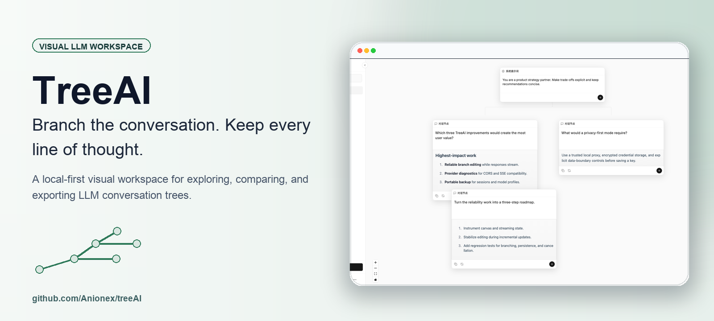
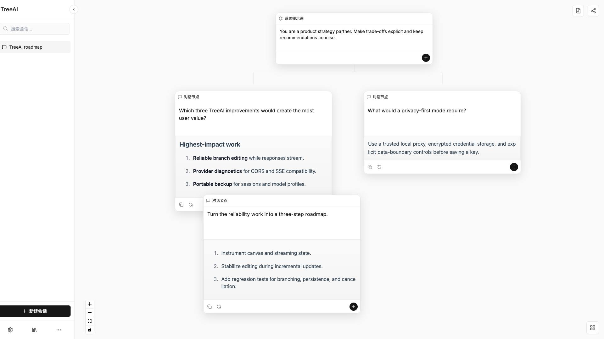

<p align="center">
  
</p>

<div align="center">

# Chatree

[](https://github.com/iroha3/chatree/actions/workflows/ci.yml)
[](LICENSE)
[](package.json)
[](src/)

**把对话变成分支，把每一条思路都留下来。**

本地优先的树状 LLM 对话工作台：支持任意 OpenAI 兼容模型，可对照不同分支，也能导出。另有桌面版。

🌐 **中文** | [**English**](README.md)

</div>

线性对话会把每次追问都塞进同一条时间线：想换一种假设试试，原来的思路就被挤出视野。Chatree 把对话变成画布 —— 从任意节点继续、并排开出分支、每个分支单独调模型参数，所有路径都保留下来，随时回看对照。

所有会话和模型配置都保存在浏览器的 IndexedDB 里。请求由浏览器直接发往你配置的 API 地址，Chatree 没有自己的后端。

<p align="center">
  
</p>

<p align="center"><sub>一个问题，多条互不覆盖的独立路径。</sub></p>

## 为什么用 Chatree

| 能力 | 说明 |
|---|---|
| **从任意节点分叉** | 换一种问法、换一个假设、换一个模型，原来的对话路径原封不动。 |
| **每个分支独立调参** | 模型 / 温度 / 最大 token 都在节点级别设置，不必给整个会话锁死一套。 |
| **对推理模型友好** | 思考链实时输出、思考完自动折叠，推理强度可配。 |
| **每条回答的用量** | token 用量、缓存命中率、生成速度一目了然。 |
| **组织** | 文件夹、收藏、全库全文搜索。 |
| **本地优先 / 可离线** | 数据只在你浏览器里；零第三方 CDN 请求，内网也能跑。 |
| **备份与恢复** | 全量 JSON 导出/导入，也能单独导出某个会话。API Key 绝不进备份。 |
| **桌面版** | 可选的原生构建（Windows / macOS / Linux），整个应用打包进去。 |

## 快速开始

### 前置条件

- [Bun](https://bun.sh)（本项目**全程用 bun**，不用 npm/node 脚本）
- 支持流式 `POST /chat/completions` 的 OpenAI 兼容接口
- 该接口允许来自 Chatree 所在 origin 的浏览器 CORS 请求

### 本地运行

```bash
git clone https://github.com/iroha3/chatree.git
cd chatree
bun install
bun run dev
```

打开 Vite 打印的地址（本项目默认 `http://127.0.0.1:5175`）。

### 第一次对话

1. 点左下角齿轮打开 **模型设置**。
2. 填模型名称、API base URL（如 `https://api.openai.com/v1`）、API Key 和提供方的模型标识。
3. 新建会话，编辑系统提示词节点。
4. 给节点加子节点，输入消息并发送。
5. 用任意节点上的 **+** 按钮继续这条分支，或另开一条并行的。

> [!IMPORTANT]
> Chatree 是纯客户端应用，API Key 以明文存在浏览器 IndexedDB 里。请使用受限密钥或可信的本地代理，不要在共享设备上配置密钥。

## 桌面版

可选的原生外壳，用 [Pake](https://github.com/tw93/Pake)（Tauri）构建。**仓库里不出现 Rust。**

```bash
bun run desktop:build        # 当前平台的完整打包
bun run desktop:build:fast   # 本地快速构建（只出可执行文件）
```

构建要求和已知坑见 [`docs/DEV.md`](docs/DEV.md)。

## 工作原理

- **对话图**：每个对话节点存一个 `parentId`，界面据此重建并渲染出一条条独立分支。
- **上下文组装**：发送某个节点时，沿它的祖先链回溯，只把这条分支的消息发出去。
- **流式**：从 SSE 消费响应并增量渲染到当前节点；思考链走单独通道。
- **持久化**：会话、节点位置、模型配置都通过 Dexie 存在本地。

## 兼容性与数据边界

Chatree 面向 OpenAI 风格的流式 Chat Completions 接口。兼容的服务需要：

- 暴露 `POST {baseUrl}/chat/completions`；
- 接受 `Authorization: Bearer ...`；
- 返回 `data:` SSE，且带 OpenAI 风格的 `choices[0].delta.content`，或 `apiService.ts` 里兼容的少数几种文本回退格式；
- 允许浏览器直接跨域请求（CORS）。

Chatree 会把配置的 API Key 直接发给该服务。本仓库不包含中继服务器、统计服务或云端账号体系。

## 项目状态

Chatree 处于早期阶段（`0.1.0`）。核心的分支工作流可以构建、可以跑。剩余工作与已知限制记录在 [`docs/ROADMAP.md`](docs/ROADMAP.md)。

## 开发

| 命令 | 作用 |
|---|---|
| `bun run dev` | 启动 Vite 开发服务器 |
| `bun run lint` | 全项目 ESLint |
| `bun run build` | 生产构建 |
| `bun run preview` | 本地预览生产构建 |
| `bun test:edge` | 纯逻辑回归（不需要浏览器） |
| `bun test:smoke` / `bun test:ux` | 端到端回归（需要 Edge + dev server） |

动手前请先读 [`docs/DEV.md`](docs/DEV.md) —— 那里写了**不能改的数据契约**、已定的交互约定，以及 React Flow / Vite / Pake 的各种坑。

## 社区

- Bug 与需求：[Issue 表单](https://github.com/iroha3/chatree/issues/new/choose)
- 开发环境、数据契约与约定：[`docs/DEV.md`](docs/DEV.md)
- 路线图与已知限制：[`docs/ROADMAP.md`](docs/ROADMAP.md)
- 版本变更：[Changelog](CHANGELOG.md)

## 上游与致谢

**Chatree 是建立在 [Anionex/treeAI](https://github.com/Anionex/treeAI) 之上的衍生作品。** 地基是上游打的：

- 树状对话模型（节点存 `parentId`、按分支回溯组装上下文）
- 本地优先的 IndexedDB 架构（Dexie）
- 最初的 React Flow 画布
- OpenAI 兼容的流式客户端

Chatree 在此基础上加的是：桌面版、推理链与用量统计、设置中心、文件夹与搜索、中英双语，以及一大串交互修正。

上游的 MIT 版权声明在 [`LICENSE`](LICENSE) 里**原样保留**（我们自己的声明追加在它下面），**完整的提交历史也一并保留** —— `git log` / `git blame` 依然能看到每一行是谁写的。

如果它帮你更清楚地探索大模型对话，欢迎给[两个仓库](https://github.com/Anionex/treeAI)都点个 Star。

以 [MIT License](LICENSE) 发布。
