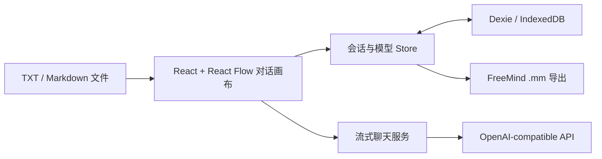

<p align="center">
  
</p>

<div align="center">

# TreeAI

[](https://github.com/Anionex/treeAI/stargazers)
[](https://github.com/Anionex/treeAI/forks)
[](https://github.com/Anionex/treeAI/actions/workflows/ci.yml)
[](LICENSE)

[](package.json)
[](src/)

**让对话分叉，也让每一条思路都被保留下来。**

一个本地优先的可视化大模型对话工作区，用于探索、对比和导出兼容 OpenAI 接口的 LLM 对话树。

🌐 **中文** | [**English**](README.md)

</div>

线性聊天会把所有追问都塞进同一条时间线：一旦探索另一种假设，原来的路径就很快被挤出视野。TreeAI 把对话变成一张画布。你可以从任意节点继续、创建并行分支、为不同分支切换模型参数，并把每一条路线完整保留下来进行比较。

所有会话和模型配置都保存在浏览器的 IndexedDB 中。请求由浏览器直接发送到你配置的 API 地址；TreeAI 本身没有应用后端。

<p align="center">
  
</p>

<p align="center"><sub>一个起点，多条独立路径；继续任意分支都不会覆盖其他思路。</sub></p>

## 为什么使用 TreeAI

| 能力 | 带来的价值 |
|---|---|
| **从任意节点分叉** | 探索另一种问题、假设或答案，同时保留原有对话路径。 |
| **每个分支独立调参** | 在节点级选择模型、温度和 token 上限，而不是让整段会话被一个配置锁死。 |
| **本地优先** | 会话和模型配置保存在浏览器 IndexedDB，中间没有 TreeAI 服务器。 |
| **导入文本上下文** | 把 `.txt` 和 `.md` 文件内容作为新的对话节点加入画布。 |
| **导出对话树** | 下载兼容 FreeMind 的 `.mm` 文件，用于归档或继续制作思维导图。 |

## 快速开始

### 前置要求

- Node.js 18 或更高版本
- npm
- 支持流式 `POST /chat/completions` 的 OpenAI-compatible API
- 服务商允许来自 TreeAI 页面来源的浏览器 CORS 请求

### 本地运行

```bash
git clone https://github.com/Anionex/treeAI.git
cd treeAI
npm ci
npm run dev
```

打开 Vite 输出的本地地址，通常是 `http://localhost:5173`。

### 开始第一段对话

1. 点击左下角齿轮，打开**模型管理**。
2. 填写模型名称、API Base URL（例如 `https://api.openai.com/v1`）、API Key 和服务商的模型标识。
3. 创建新会话并编辑系统提示词节点。
4. 添加子节点，输入消息并发送。
5. 点击任意节点上的 **+**，继续当前分支或创建并行路径。

> [!IMPORTANT]
> TreeAI 是纯前端应用，API Key 会以未加密形式保存在当前浏览器的 IndexedDB 中。请使用权限受限的 Key 或可信的本地代理，不要在共享或不可信设备上配置凭据。

## 工作原理



- **对话图结构：** 每个聊天节点保存 `parentId`，界面据此重建和渲染独立分支。
- **上下文组装：** 发送某个节点时，TreeAI 会沿父节点向上回溯，只提交该分支上的消息链。
- **流式输出：** 应用读取 Server-Sent Events，并把增量内容实时渲染到当前节点。
- **本地持久化：** 会话、节点位置和模型配置通过 Dexie 保存在浏览器中。

## 兼容性与数据边界

TreeAI 当前面向 OpenAI 风格的流式 Chat Completions API。兼容服务商需要：

- 提供 `POST {baseUrl}/chat/completions`；
- 接受 `Authorization: Bearer ...`；
- 返回 `data:` 形式的 Server-Sent Events，并提供 OpenAI 风格的 `choices[0].delta.content`，或 `apiService.ts` 已处理的少量兼容文本结构；
- 允许浏览器通过 CORS 直接请求。

TreeAI 会把配置的 API Key 直接发送给对应服务商。仓库不包含中转服务器、统计分析服务或云端账户系统。

## 项目状态与限制

TreeAI 仍处于早期阶段（`0.1.0`）。核心树状对话流程可以构建和运行，但目前存在以下明确限制：

- 暂不支持思考模型或服务商特有的 reasoning stream；
- 文件文本提取目前只启用 `.txt` 和 `.md`；
- 模型凭据在本地保存，但没有加密；
- 暂无账户同步、多人协作和跨设备备份；
- 尚未加入自动化应用测试；CI 目前验证 ESLint 和生产构建；
- 生产 bundle 仍偏大，后续需要进行代码拆分。

当前工作可见 [todo.md](todo.md) 和 [GitHub Issues](https://github.com/Anionex/treeAI/issues)。

## 开发

| 命令 | 用途 |
|---|---|
| `npm run dev` | 启动 Vite 开发服务器。 |
| `npm run lint` | 对整个项目运行 ESLint。 |
| `npm run build` | 生成生产构建。 |
| `npm run preview` | 在本地预览生产构建。 |

主要目录：

```text
src/
├── components/       # 画布、节点、侧栏、模型管理、文件上传
├── context/          # 数据库加载边界
├── db/               # Dexie / IndexedDB 持久化
├── services/         # OpenAI-compatible 流式请求
├── stores/           # 会话与模型状态
└── utils/            # 文件提取、通知、思维导图导出
```

提交 Pull Request 前请运行：

```bash
npm ci
npm run lint
npm run build
```

## 社区

- 使用和配置帮助：[支持指南](SUPPORT.md)
- Bug 与功能建议：[Issue 表单](https://github.com/Anionex/treeAI/issues/new/choose)
- 参与贡献：[贡献指南](CONTRIBUTING.md)
- 安全问题：[安全策略](SECURITY.md)
- 社区规范：[行为准则](CODE_OF_CONDUCT.md)
- 用户可见变更：[更新日志](CHANGELOG.md)
- 赞助项目：[Funding 说明](FUNDING.md)

## 关于

TreeAI 由 [Anionex](https://github.com/Anionex) 维护。如果它让你更清晰地探索大模型对话，欢迎 Star、分享、提交可复现的问题、贡献聚焦的改进，或通过 [Funding 说明](FUNDING.md) 支持持续开发。

本项目采用 [MIT License](LICENSE) 开源。
