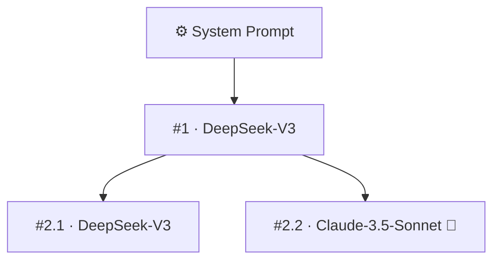

# Chatree 对话树导出规范

> 本文档是「Chatree 树状会话」导出为 Markdown 的目标契约。
>
> **规范基底**：整体以 **AfterChat 规范（AfterChat Format）** 为基底进行修改与特化。AfterChat 规范结构规整、约束严密（如单一 `## Conversation` 定界符、严格的角色头正规化、正文标题降级转粗体防消息截断），非常适合作为 LLM 对话导出的事实标准。
>
> **为什么单独特化**：AfterChat 原生主要面向一维线性对话。而 Chatree 采用非线性分支对话树（Tree of Thoughts），一个会话既包含同一节点下的多模型重试，也包含用户在历史节点的任意追问分叉（多层深度嵌套树）。为了将树状拓扑无损、清晰地投影到线性 Markdown 文档中，特在继承 AfterChat 核心约束的基础上制定本扩展规范。

---

## 1 通用规则（继承自 AfterChat 规范）

- **物理约束**：`.md` 扩展名、UTF-8 编码、LF/CRLF 跨平台换行。
- **结构骨架**：`## Metadata` 位于文件顶部，正文起始处有且仅有一行二级标题 `## Conversation`。
- **角色标识头契约**：严格遵循 `^###\s+.*\b(User|Assistant)\b.*$` 及 `### ⚙️ System` 的正则匹配契约。
- **消息体转换（stripHashes）**：正文中的所有 Markdown 标题行（`#`～`######`）一律转换为 `**加粗文本**`，但代码围栏（`` ``` ``、`~~~`）及行内代码内的 `#` 严格保持原样。
- **思维链结构**：若节点包含 `reasoning`，统一在助手角色头后按 `#### 🤔 Thought Process` 与 `#### 💡 Response` 分段展开；无思维链时直接跟随正文。

---

## 2 差异与扩展

| 差异点 | AfterChat 基础规范 | 树状会话（Chatree 扩展） |
|---|---|---|
| **会话拓扑** | 严格一维单链 | 任意深度与分支的对话树（Tree of Thoughts） |
| **Mode 标识** | 缺省（线性对话） | `tree`（整树导出） |
| **拓扑导览** | 无 | Metadata 区包含 `### 🗺️ Topology` 纯逻辑 Mermaid 树图 |
| **逻辑编号** | 无 | 层级分支编号（如 `#1`, `#2.1`, `#2.2`, `#3.1`），图文双向索引 |
| **助手消息头** | 固定 `### 🤖 Assistant` | `### 🤖 Assistant — <model>`（附带模型名） |
| **用户消息头** | 固定 `### 🧑‍💻 User` | 分支分叉时为 `### 🧑‍💻 User — 分支 i/n` |
| **节点锚点线索** | 无 | 结构化坐标 `> 📌 **Node:** ... \| **Forked from:** ...` |

### 2.1 导出模式划分

Chatree 支持两种导出粒度，分别对应不同的使用场景：

1. **整树导出（Full Tree Export）**
   - **入口**：画布右上角「分享与导出 → Markdown (.md)」。
   - **特点**：携带 `Mode: tree`、Mermaid 拓扑图及层级大纲编号（`#1`、`#2.1`），完整保留会话树的所有分支脉络与多模型探索记录。
2. **单路径导出（Single Path Export）**
   - **入口**：双击节点打开「连续阅读浮层」，在浮层顶部工具栏点击「导出路径」。
   - **特点**：基于 `buildPath` 仅导出「根节点 → 当前选中节点」的确定性单链。直接退化为标准的一维线性 AC 格式（无 Mode 声明、无 Mermaid 拓扑图、无 `#` 大纲编号与分支面包屑），专注产出干净的最终交付文档。

---

## 3 标准模板

````markdown
## Metadata

- **Mode:** `tree`
- **Models:** `DeepSeek-V3`, `Claude-3.5-Sonnet`
- **Nodes:** 4
- **Branches:** 2
- **Time:** 2026-10-03 14:00:00 +08:00

### 🗺️ Topology



## Conversation

### ⚙️ System

你是一个资深系统架构师。

### 🧑‍💻 User

请对比现代前端构建工具的演进方向。

### 🤖 Assistant — DeepSeek-V3
> 📌 **Node:** #1

前端构建工具主要经历了以下演进阶段……

### 🧑‍💻 User — 分支 1/2
> 📌 **Node:** #2.1 | **Forked from:** #1

如果是小型个人项目，优先推荐哪种？

### 🤖 Assistant — DeepSeek-V3
小型项目推荐优先使用轻量、即开即用的方案……

### 🧑‍💻 User — 分支 2/2
> 📌 **Node:** #2.2 | **Forked from:** #1

如果是超大型 Monorepo 场景呢？

### 🤖 Assistant — Claude-3.5-Sonnet
> 📌 **Node:** #2.2 | **Forked from:** #1

#### 🤔 Thought Process

分析大型 Monorepo 的增量构建与缓存机制……

#### 💡 Response

大型 Monorepo 下的关键诉求是远程分布式缓存与精准任务编排……
````

---

## 4 Metadata 区定义

位于文件顶部，必须出现在 `## Conversation` 之前。

| 键名 | 必填 | 规范说明 |
|---|---|---|
| `Mode` | ✅ | 固定为 `tree`，明确告知消费端与归档系统本文件为树状拓扑导出 |
| `Models` | ✅ | 当前对话树所有出现过的模型 `name`，按首次出现顺序去重，以逗号分隔 |
| `Nodes` | ✅ | 会话中有效问答节点总数（不含 System 节点） |
| `Branches` | ✅ | 最终叶子分支数（无子节点的末梢数） |
| `Time` | ✅ | 会话发生或创建的本地时间，格式：`YYYY-MM-DD HH:mm:ss ±HH:MM` |

### 4.1 Topology 纯逻辑拓扑图（Mermaid）

- **位置约束**：位于 `## Metadata` 区末尾、`## Conversation` 正文定界符之前。
- **免 LLM 依赖原则**：节点**严禁**放置未经安全清洗的用户文本或不可靠的截断短语，全部由确定性的离散元数据生成：
  - 节点语法：`NodeId["{nodeIndex} · {modelName}{reasoningMarker}"]`
  - 若包含思维链（`reasoning`），在模型名末尾追加 ` 💭`。
  - 特殊符号必须进行清洗与安全转义（过滤双引号、方括号等）。

---

## 5 Conversation 正文区展开规范

### 5.1 根节点处理（System Prompt）
Chatree 遵循单根规范（单一会话仅允许一个根）。
- 若存在系统提示词节点（`type === 'system'`），必须作为 `## Conversation` 之后的第一条消息输出：
  ```markdown
  ### ⚙️ System

  系统提示词正文
  ```

### 5.2 对话树遍历算法（DFS 深度优先先序遍历）
- 按照深度优先先序遍历展开各分支，确保任意一条分支的上下文沿时间线连续往下呈现，直到叶子节点，再回溯展开同级兄弟分支。
- 兄弟节点之间按创建时间升序（`createdAt`）依次遍历。

### 5.3 层级分支编号规则（Hierarchical Indexing）
系统根节点不计入数字轮次。直接子节点（第 1 轮问答）深度记为 `depth = 1`。
- 若整条主线上无分叉，编号依次为 `#1`、`#2`、`#3`……
- 当某个父节点产生 $M$ 个分叉（$M > 1$）时，各子节点分配分支后缀：第 $i$ 个子节点编号为 `#{depth}.{i}`（例如 `#2.1`、`#2.2`）；
- 若后续节点无进一步分叉，则沿用父分支后缀，例如 `#2.1` 的唯一子节点记为 `#3.1`；若再次产生分叉，则扩展为 `#3.1.1`、`#3.1.2`。
- 该编号全局唯一且精确反应其所处的深度（轮次）与分支脉络。

### 5.4 节点坐标锚点（Anchor Line）
在正文每个节点的消息体顶部统一追加引用块格式的坐标线索：
```markdown
> 📌 **Node:** #2.1 | **Forked from:** #1
```
- 若为首轮问答（无父问答节点），则为：`> 📌 **Node:** #1`。
- 读者与解析器可通过该行直接与顶部的 Topology 图完成双向比对。
